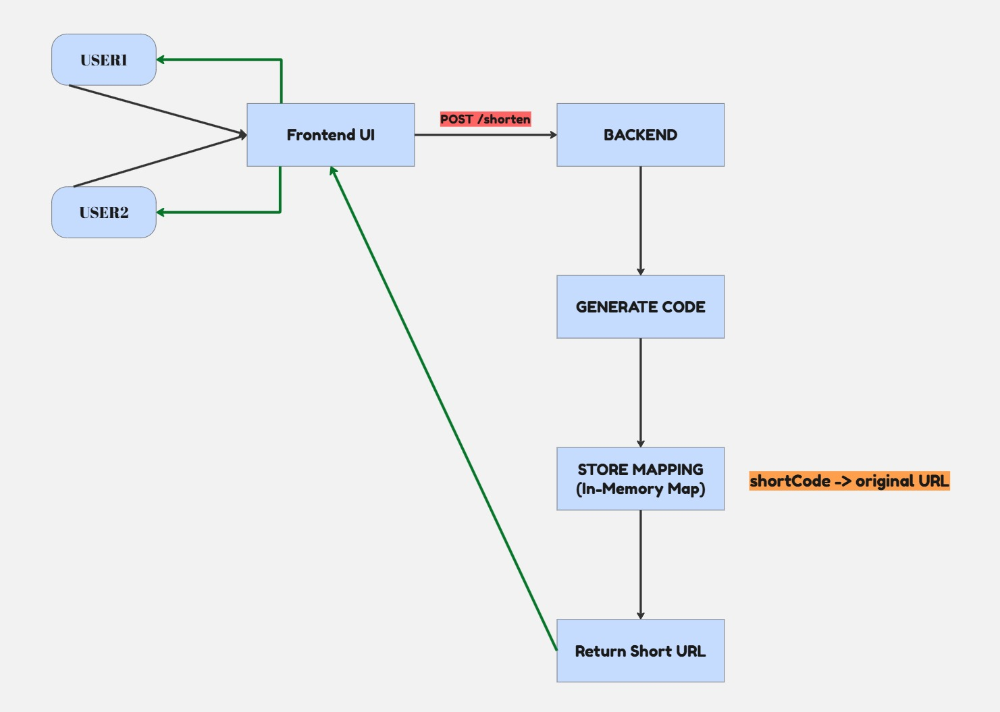
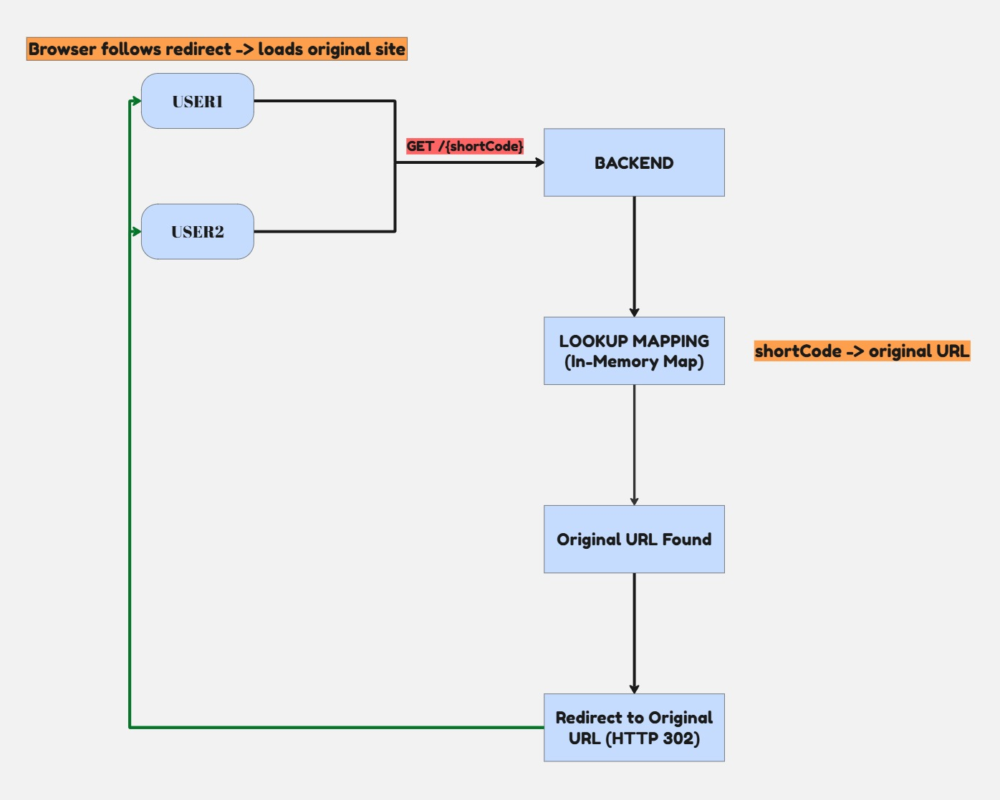

# 🔗 Step 2 — Core Functionality Design

> Before touching a database or thinking about scale, the most important step is designing the core logic clearly. This document defines exactly what the system does, how data flows through it, and what the initial implementation looks like.

---

## 📋 Table of Contents

- [Why Design Before Building?](#-why-design-before-building)
- [The Core Idea](#-the-core-idea)
- [Flow 1 — URL Shortening (Creation)](#-flow-1--url-shortening-creation)
- [Flow 2 — URL Redirection (Usage)](#-flow-2--url-redirection-usage)
- [How the Two Flows Connect](#-how-the-two-flows-connect)
- [API Contracts](#-api-contracts)
- [Initial Implementation — In-Memory Storage](#-initial-implementation--in-memory-storage)
- [Key Takeaway](#-key-takeaway)

---

## 🤔 Why Design Before Building?

It's tempting to jump straight to code. But without a clear design, you end up making structural decisions mid-implementation — which leads to rewrites.

Before writing any code, we need answers to three questions:

| Question | Answer (for this project) |
|---|---|
| What data does the system store? | A mapping: `shortCode → originalUrl` |
| How does data enter the system? | Via a `POST /shorten` request |
| How does data leave the system? | Via a `GET /{shortCode}` redirect |

Once these are clear, the implementation becomes straightforward.

---

## 🔑 The Core Idea

The entire system is built on one relationship:

```
shortCode  ──────────────►  originalUrl
 "abc123"                    "https://example.com/very/long/path"
```

Every feature in this project — the API, the database schema, the cache layer — exists to support this single mapping. Keep this in mind as complexity grows.

---

## 🔹 Flow 1 — URL Shortening (Creation)

This flow runs **once** when a user wants to create a short link.

### Trigger

```http
POST /shorten
```

Initiated by a frontend button click, a form submission, or directly via an API client (e.g. Postman).

### Step-by-Step

```
1. Client sends a POST request with the long URL in the request body

2. Backend validates the input
      → Is the URL present?
      → Is it a valid URL format?

3. Backend generates a unique short code
      → e.g. random 6-character alphanumeric: "abc123"

4. Backend stores the mapping
      → "abc123" → "https://example.com/very/long/path"

5. Backend returns the short URL to the client
      → "http://localhost:8080/abc123"
```

### Visual Flow



### What Could Go Wrong?

| Scenario | Expected Behaviour |
|---|---|
| Missing or empty URL in request body | Return `400 Bad Request` |
| Malformed URL (not a valid link) | Return `400 Bad Request` with message |
| Short code collision (rare) | Regenerate and retry |

> **📌 Design Note:** Short code collision — two different URLs generating the same code — is unlikely with 6 Base62 characters (56 billion combinations) but must be handled. The simplest fix: check if the code already exists in storage before saving, and regenerate if it does.

---

## 🔹 Flow 2 — URL Redirection (Usage)

This flow runs **every time** a user visits a short link. It is the high-frequency path — at scale, this endpoint handles far more traffic than `/shorten`.

### Trigger

```http
GET /{shortCode}
```

Initiated automatically when a user types or clicks the short URL in a browser.

### Step-by-Step

```
1. Browser sends a GET request to http://localhost:8080/abc123

2. Backend extracts the short code from the path
      → shortCode = "abc123"

3. Backend looks up the mapping in storage
      → Found: "abc123" → "https://example.com/very/long/path"

4. Backend returns HTTP 302 with a Location header
      → Location: https://example.com/very/long/path

5. Browser follows the redirect automatically
      → User lands on the original URL
```

### Visual Flow



### What Could Go Wrong?

| Scenario | Expected Behaviour |
|---|---|
| Short code not found in storage | Return `404 Not Found` |
| Short code exists but URL is malformed | Return `500` or handle gracefully |

### Why HTTP 302 (Not 301)?

This is a deliberate choice, not a default:

| Status | Meaning | Browser Behaviour | Use When |
|---|---|---|---|
| `301 Moved Permanently` | Permanent redirect | Browser **caches** the redirect — never calls your server again for this code | Links that will never change |
| `302 Found` | Temporary redirect | Browser **always** checks your server on each visit | Development, analytics, updatable links |

Using `302` means every redirect request hits your server — which lets you track clicks, update destinations, or expire links. Use `301` only when a link is truly permanent and you want to reduce server load.

---

## 🔗 How the Two Flows Connect

The flows are independent in execution but tightly coupled through shared storage:

```
 CREATION FLOW                      REDIRECTION FLOW
 (runs once)                        (runs many times)
      │                                    │
      ▼                                    ▼
 POST /shorten                      GET /{shortCode}
      │                                    │
      │   WRITES mapping                   │   READS mapping
      ▼                                    ▼
┌─────────────────────────────────────────────────┐
│              Storage                            │
│         "abc123" → "https://..."               │
└─────────────────────────────────────────────────┘
```

The creation flow is useless without the redirection flow (nothing can use the short link). The redirection flow is useless without the creation flow (there's nothing to look up). They are two halves of the same system.

---

## 📡 API Contracts

Defining the API contract up front prevents ambiguity when implementing or integrating with a frontend.

---

### `POST /shorten` — Create a Short URL

**Request:**
```http
POST /shorten
Content-Type: application/json

{
  "url": "https://example.com/some/very/long/path?ref=abc&campaign=xyz"
}
```

**Success Response — `200 OK`:**
```http
HTTP/1.1 200 OK
Content-Type: application/json

{
  "shortUrl": "http://localhost:8080/abc123",
  "shortCode": "abc123",
  "originalUrl": "https://example.com/some/very/long/path?ref=abc&campaign=xyz"
}
```

**Error Response — `400 Bad Request`:**
```http
HTTP/1.1 400 Bad Request
Content-Type: application/json

{
  "error": "Invalid or missing URL"
}
```

---

### `GET /{shortCode}` — Redirect to Original URL

**Request:**
```http
GET /abc123
```

**Success Response — `302 Found`:**
```http
HTTP/1.1 302 Found
Location: https://example.com/some/very/long/path?ref=abc&campaign=xyz
```

**Error Response — `404 Not Found`:**
```http
HTTP/1.1 404 Not Found
Content-Type: application/json

{
  "error": "Short URL not found"
}
```

---

## 🗄️ Initial Implementation — In-Memory Storage

For the first working version, mappings are stored in a `HashMap` in application memory. No database, no configuration — just logic.

```java
@Service
public class UrlShortenerService {

    // In-memory store: shortCode → originalUrl
    private final Map<String, String> urlStore = new HashMap<>();

    public String shortenUrl(String originalUrl) {
        String shortCode = generateShortCode();
        urlStore.put(shortCode, originalUrl);
        return "http://localhost:8080/" + shortCode;
    }

    public String getOriginalUrl(String shortCode) {
        return urlStore.get(shortCode); // returns null if not found
    }

    private String generateShortCode() {
        // Random 6-character alphanumeric code
        return UUID.randomUUID().toString().substring(0, 6);
    }
}
```

### Trade-offs of This Approach

| Aspect | In-Memory (`HashMap`) | Database (next step) |
|---|---|---|
| Setup required | None | PostgreSQL install + config |
| Data survives restart | ❌ No | ✅ Yes |
| Works across multiple servers | ❌ No | ✅ Yes |
| Query / filter / sort data | ❌ No | ✅ Yes |
| Speed | ✅ Extremely fast | Slightly slower (network I/O) |

**Start here.** Get the logic right first. Replace the `HashMap` with a database once the core flow is working end-to-end — swapping the storage layer is straightforward when the service is properly structured.

---

## 🧠 Key Takeaway

The URL shortener, at its core, is just two operations:

```
Write:   shortCode → originalUrl     (POST /shorten)
Read:    shortCode → redirect         (GET /{shortCode})
```

Every architectural decision — the database schema, the cache strategy, the API design — is in service of making these two operations correct, fast, and reliable. Design the core first. Build complexity only when the foundation is solid.